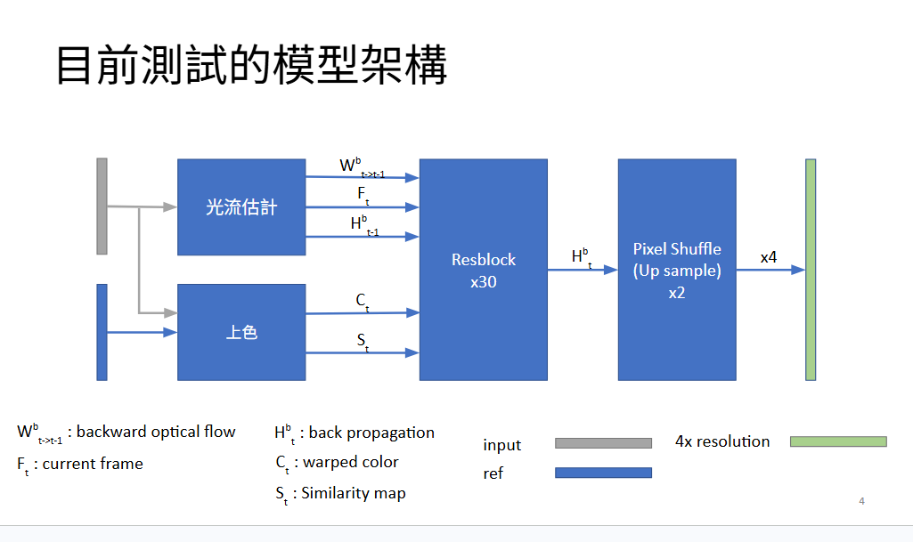

# Single-Reference-Frame Guided Video Colorization and Super-Resolution

This repository is an experimental side project for **single-reference-frame guided video colorization and video super-resolution**.

Given a low-resolution grayscale video sequence and one low-resolution color reference frame from the same video, the model aims to reconstruct a high-resolution color video sequence.

The project is mainly based on a BasicVSR-style temporal propagation architecture, with an additional reference-guided colorization branch.

---

## Task Definition

### Input

* Low-resolution grayscale video frames
* One low-resolution color reference frame from the same video

### Output

* High-resolution color video frames

Only one frame contains color information. The model needs to propagate color and temporal features to the remaining frames.

---

## Pipeline

---

## Model Architecture

The model was inspired by:

* **BasicVSR** for temporal feature propagation in video super-resolution
* **Deep Exemplar-Based Video Colorization** for reference-guided colorization

The main components are:

1. **Optical flow estimation**
   Estimates motion between neighboring frames.

2. **Temporal feature propagation**
   Propagates features across frames using optical-flow-based warping.

3. **Reference-guided colorization branch**
   Uses the single color reference frame to produce color-related features and a similarity map.

4. **Feature fusion and reconstruction**
   Combines current-frame features, propagated temporal features, and reference-guided color features.

5. **PixelShuffle upsampling**
   Produces the final 4x high-resolution color output.

---

## Ablation Study

The ablation study evaluates BasicVSR-style propagation components and different loss settings.

| Connection Method           | Loss                  |  PSNR |
| --------------------------- | --------------------- | ----: |
| Unidirectional              | L1                    | 30.17 |
| Bidirectional               | L1                    | 30.52 |
| Bidirectional               | L1 + GAN              | 30.09 |
| Bidirectional               | L1 + GAN + Perceptual | 29.49 |
| Bidirectional + Cross-frame | L1                    | 30.80 |
| Bidirectional + Cross-frame | L1 + GAN + Perceptual | 28.94 |

---

## Observations

The best PSNR was achieved by the **bidirectional + cross-frame model with L1 loss**.

From the ablation results:

* Bidirectional propagation performed better than unidirectional propagation.
* Cross-frame feature aggregation further improved PSNR under the L1-only setting.
* GAN and perceptual losses reduced PSNR in this experiment.

Although the L1-only model achieved higher PSNR, its output tended to look smoother and more conservative. After adding GAN and perceptual losses, the results became more visually vivid in some cases, but the pixel-wise PSNR decreased.

This reflects the common trade-off between pixel-wise reconstruction accuracy and perceptual visual quality.

---

## Limitations

This project is an experimental implementation and has several limitations:

* No full comparison with standard video colorization or video super-resolution baselines
* Limited training setup and dataset scale
* GAN and perceptual loss weights were not extensively tuned
* PSNR was the main evaluation metric, which may not fully reflect perceptual quality
* The color reference frame comes from the same video, so this is a controlled reference-guided setting rather than fully automatic video colorization

---

## References

* BasicVSR: The Search for Essential Components in Video Super-Resolution and Beyond
* Deep Exemplar-Based Video Colorization

---

## Project Status

This repository is kept as a side project and experimental research implementation.

The main purpose is to explore BasicVSR-style temporal propagation under a single-reference-frame guided video colorization and super-resolution setting.
